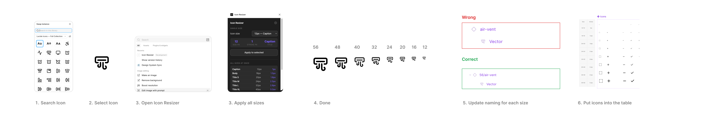

# Icon Resizer — Figma Plugin

A Figma plugin tailored for Lucide-based design systems. Automatically generates all icon sizes with correct stroke weights in one click — no more manual resizing.



---

## Features

- Generate all 8 sizes at once from a single icon
- Correct stroke weight applied automatically per size
- Apply a single size to any selected icon
- Fully customizable presets (size, stroke, title) via Settings
- Settings are saved between sessions via `figma.clientStorage`
- Works with any icon type

## Size Presets (default)

| Title         | Size  | Stroke |
|---------------|-------|--------|
| Caption       | 12px  | 1.0px  |
| Body          | 16px  | 1.5px  |
| Title S       | 20px  | 1.8px  |
| Title M       | 24px  | 2.5px  |
| Title L       | 32px  | 2.8px  |
| Title XL      | 40px  | 3.2px  |
| Title XXL     | 48px  | 4.5px  |
| Title 4XL     | 56px  | 5.2px  |

---

## Installation

> ⚠️ Requires **Figma Desktop App** — does not work in the browser.

1. Download or clone this repository
2. Open Figma Desktop
3. Menu → Plugins → Development → **Import plugin from manifest**
4. Select the `manifest.json` file from the folder
5. Run via Menu → Plugins → Development → **Icon Resizer**

---

## How to use

### Generate all sizes
1. Search for an icon in the Lucide library
2. Select the icon on your canvas
3. Open Icon Resizer
4. Click **Generate all sizes →**
5. All 8 sizes appear in a row next to the original with correct parameters
6. Update naming for each size and place into your table

### Apply a single size
1. Select one or more icons
2. Choose the size from the dropdown
3. Click **Apply to selected**

### Customize presets
The plugin comes with default presets based on a standard type scale, but you can fully customize them to match your own design system.

1. Click the ⚙ icon in the top right
2. Edit any value in the table — Title, Size (px) or Stroke (px)
3. Click **Save** — changes apply immediately and persist across sessions
4. Click **Reset defaults** to restore the original values at any time

This means the plugin adapts to any design system, not just Lucide.

---

## Files

```
icon-resizer/
├── manifest.json
├── code.js
└── ui.html
```

---

## Author

Made by [your name] · [figma.com/@yourhandle](https://figma.com)
